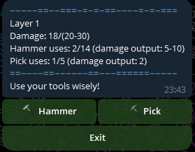
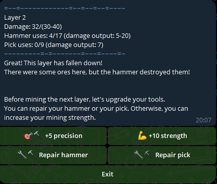

# Introduction

Ore Miner is the only place where you can get money and blocks just based on immediate actions and choices. As such, mastering it can be the key to winning a season!

In the mine you can find various things, not just **money** and **blocks** but **protections** and **coal**. Protections should be used in future mining adventures, but coal can be exchanged for other objects on the Flea Market! Or you can use it to be sure to land on a station in Global Steel Road, which can mean the difference between selling goods for big prizes or not.


But what's the deal? Well, while it looks simple, mining does have a steep learning curve. Once you understand a few key elements, you'll get deeper and deeper into layers giving increasingly more prizes.

## Let's start with the basics.



Each layer has a hit point value (let's call it **HP**) and a higher **boundary**, that is normally HP+10.
To correctly break the layer and advance to the next, you need to hit it enough, so that the damage you've dealt is between HP and the boundary, with extremes included (so if HP is 50 and boundary is 60, your last hit should land the damage to 50, 51, ...59, 60).

If the damage lands even just to one hit point higher, you've lost!

This boundary can be extended by starting the game using your **protections**. You receive one by breaking layers ending with 9, or from other parts of IdleBank Alpha!

You can deal damage with two tools: the **hammer** and the **pickaxe**.

## The tools

The hammer is imprecise, meaning it deals damage within a range, so there is some chance involved!
But it is also strong and durable.
The pick deals about half the damage and has half the durability. But at least you know the exact damage it will deal.

Not to mention that the prizes you receive are dependent on the tool you use for the last hit. If you use the pick, you are sure you will get money, and you will get blocks if the layer has any.
If the last hit is given with the hammer, instead, you won't get money and you only have a small chance to get the blocks!

This gives us the initial **base strategy**: you should build most of the damage with the hammer, and use the pick for the last 1 or 2 hits.
Always look at the durability, though! If you use your last hit on either of the tools, and you didn't break the layer on that hit, you will lose!

This leads us to the between-layers menu.

## Repairing and Upgrading



This is where most of the strategy lies, to the point that an expert player might spend more than a minute there deciding what to do, or knowing that only one option is safe... Or even none!

Options are: repairing either tool, increasing the strength of both tools or the precision of the hammer.

**Repairing** simply resets the hits on the selected tool, so that it's brand new!
Increasing the **strength** increases the maximum yield of the hammer by __10__, and the yield of the pick by __5__.
Increasing **precision**, instead, improves the minimum yield of the hammer by __5__.

That means that in other to keep maximum precision you need to improve it twice for every time you increased the strength.


# Upgrading strategy

The core skill is knowing when to upgrade.

### Checking the hammer health

The first question you should always ask yourself is __how many hammer hits are needed to complete the layer__. We know that each layer will generally use 1 or 2 pickaxe hits, but what about the hammer?

To know this, you simply divide the layer HP (not the boundary) by the average yield of the hammer. Let's say the layer has 140 HP, and your hammer deals 45-50 damage, you will need 3 hits

```
For a detailed analysis:
140 / 45 = 3.111
140 / 50 = 2.8

So with 3 hits you might or might not finish the layer, but that is irrelevant.
The correct strategy to get the ores is to give 2 hammer hits and finish up the layer with the pick.
Each hammer hit deals roughly the same as two pickaxe hits, so we are expecting 2 hammer hits and 2 or 3 pickaxe hits
```

So we actually really need __2__ hits. This number, 2, will not change quickly. Each new layer will have 10 more HP (sometimes more, but generally 10). With a yield of 45-50 HP per hit, the number of hits needed will only increase after 5 layers. Which is plenty to upgrade.

Why do you need to keep this number in mind? Because if at the end of a layer you realize your __hammer does not have that number of hits__, **you need to repair it** asap!


### Checking the pickaxe health

As stated above, the pickaxe will only deal the last few hits, rarely more than 2.

So one would be inclined to only repair the pick when it is on its last 2 hits. Well, that can be the wrong choice! To repair the pick, you will use one repairing opportunity. __What if the hammer also need repairing on that same turn?__

While the pick is important to get the ores and blocks, the __hammer can compensate for its absence__, but it is dangerous because you risk getting over the boundary. The pick cannot compensate for the absence of the hammer, unless you only needed 1-2 more hammer hits and you have enough pick hits.

Thus, it is advisable to **keep the pick at least 4 hits under its breaking point**. If you want not to repair the pick at that point, just **make sure your hammer has enough health for 2 layers**.

Pay attention to this last point: to repair the pick, or even to upgrade, you need your hammer to sustain two layers.

Remember that number I wanted you to keep in mind? Double that! __If your hammer does not have enough health to break **two** layers, you are in a dangerous situation and you are unlikely to progress much further, basically your game is ending.__


## Actually Upgrading

From what we gathered above, the goal of upgrading is to make it so the hammer can break two full layers without breaking itself.

The hammer health can increase, but that is not under your control: the health of both tools should be treated as a static element, it is based on your record layer, so that once you have done a great mining session you will have an easier time on future games!

So what can you control? The hammer strength and precision!

### More strength = Better!

```
Let's make a new example. The layer has 70 HP.
Imagine your hammer can deal maximum 12 hits before breaking, and its current yield is 10-20.

70 / 10 = 7
70 / 20 = 3.5

The pick is going to deal a damage of 7
Since it is very unlikely that the hammer will deal just 10 damage for 6 hits in a row, we can assume that you will need less than 6 hits with your hammer, and you will finish the work with the pick.

Since your hammer can deal 12 hits before breaking, you should be able to break two layers in a row.
So you have 1 opportunity to upgrade or repair the pick between those two layers!
```

From the above example you might have guessed how important it is to upgrade the precision of the hammer. It basically allows you to better predict your chances of surviving two layers in a row without repairing the hammer between them.

So this could be a __safe__ upgrading loop:

1. up strength
2. repair hammer
3. repair pick
4. repair hammer
5. up precision
6. repair hammer
7. repair pick
8. repair hammer
9. up precision
10. repair hammer
11. repair pick
12. repair hammer

Depending on the ratio between the needed hammer hits and its health, you can cut some hammer or pick repairing steps. So that's where the extra health comes into play: as your maximum layer increases, you'll be able to upgrade much faster at the beginning of new games!

### More strength = ... Worse??

Aren't we forgetting something? Yes, the boundary!

While upgrading a lot is crucial to go deeper and deeper in the mine, we must not forget that from high strength comes high risk of breaking the mine over the boundary, losing the game.

```
Let's say we are at a layer with 90 HP, and the boundary is at 100.
And you currently have: hammer yield 15-20, pick yield 7

The game shows: "Damage: 60/(90-100)"

Note how with two hammer hits you are sure to break the layer safely!
You can also do one hammer hit and two pick hits, and you are almost sure to break it safely
(if the hammer deals the minimum of its range, you get 60 + 15 + 7 + 7 = 89/(90-100))

Another case: "Damage 70/(90-100)"
hammer yield 15-20, pick yield 7

Here if you do one hammer hit, you have 1/6 chance to break the layer without collecting the ores.
Otherwise you'd get to 85-89 HP.
If you get to 85 HP, another hammer hit has 5/6 chance to go over the boundary!

Thus, it seems like the safest option here is to do 3 pick hits, dealing 21 damage, reaching 91/(90-100), safely collecting ores.

Last case:
Another case: "Damage 65/(90-100)"
hammer yield 20-30, pick yield 12

This is a dangerous situation!
When in danger you might be inclined to use the pick, but here it would be a tragic mistake:
- pick -> 77/(90-100)
- pick -> 89/(90-100)
- pick -> 101/(90-100)

or
- pick -> 77/(90-100)
- hammer -> 4/11 of being safe, 97 to 100, 7/11 of losing, 101 to 107

If instead we start with our imprecise hammer, and we get in one of 3 different situation:
-> 4/11 of landing on 85-88, -> pick, win with ores
-> 1/11 of landing on 89, -> you lose whatever you do
-> 6/11 of landing on 90-95 -> you win the layer, but you don't get the ores

```
What do we learn from the above example?

__As long as the pick has a lower yield than the range between HP and boundary, we are safe!__

So the issue with the last example above is that the range is of 11 hit points (90 to 100) and the pick deals 12!

The difference between these two values is only one, so it's not that common to run into the problem, as we have seen. But it is a possibility that you get to 89 (in general, HP-1).

Had the pick been even stronger, at 17 yield against a 11 safe range, you'd need to be careful of any damage value between HP-6 and HP-1!

As a rule of thumb, **the first thing you should do as you start a game is increase strength (and precision) until your pick yield is just under the safe range**!

You still need to be careful as your hammer yield will be higher than the safe range, but you will always have a route to victory and ores.

### Taking a chance

We now have the two opposite needs: upgrading to reduce uses of the hammer, not upgrading to always have a route to safety.

Staying in this safe heaven does not guarantee the best outcome. Once your hammer uses close to half of its hits to break a layer, we know that we are at a crossroads: either we don't upgrade and safely and the game after a few layers, or we take a chance and upgrade the strength.

**Both options are valid!**. Especially when the hammer yield gets in the 80+ territory, not upgrading still allows us to continue for many layers, as you only use one more hit every 7 layers. Repairing the pick becomes increasingly difficult, but as long as you time things correctly you can progress a lot. And if your hammer deals like 200 hits, you can try going for enough more layers to get two more protections for the next adventure.

But, of course, if you want to go on you will need to upgrade __unsafely__ once or twice. Once you do that, it will be hard to keep track of everything at the same time, but it is definitely a worthy challenge. Getting more protections and reaching new record depths (increasing the tools max health forever) will help in the future.

If you are particularly careful and lucky, you might even upgrade two or three times before going over the boundary.

That said, getting a lot of protections from other parts of the game, and then using them to upgrade the strength a lot, is a more efficient way to get to high layers. It can be a waste of resources thought!


# Modding

In case you are considering downloading the IdleBank Alpha source code and hosting your own version of the game, you might want to mod Ore Miner to make it easier or harder (changing prizes accordingly, perhaps!)

As we have seen in this guide, there are subtle parameters that can drastically change the experience.

Here is a list of options to make the game easier:
- Simply increasing the base health of tools (this already happens as a monthly variation)
- Increasing the base boundary (this already happens as a monthly variation)
- Increasing the value of protections, right now one protection grants 10 more boundary, even just increasing this to 12 can result in way faster growth for your players
- Decreasing the pick base damage by just 1 will allow players to upgrade one extra time in complete safety
- Decreasing the damage upgrade to the pick from 5 to 4 will make the game drastically easier
- Decreasing the blocks needed to respawn will make the game feel more forgiving
- Changing the precision upgrade math, for example rather than increasing the minimum yield of the hammer by 5, it can halve the range. This way players can decide to first upgrade strength a lot and only then upgrade the precision, saving many upgrading steps.
- Increasing the tool bonus health that depends on the record layer

These changes can make the game harder:
- Doing the opposite of all the options above!
- Eliminating the chance of getting blocks when using the hammer as the last hit
- Only giving protections by chance, rather than surely
- Changing the respawn math (for example, rather than having a checkpoint every 10 layers, you can have one every 50)
- Changing how repairing works so that it doesn't completely reset the tool health, it actually only repairs it partially, like just 10 hits or something. This will become a hard limit on how far you can go in the mine
- Decreasing the strength upgrading from +10 to something less (keep your precision math in check tho)
